<div align="center">



[](https://www.npmjs.com/package/@briank-dev/pptx-to-html) [](Cargo.toml) [](https://brnyxx.github.io/pptx2html-turbo/) [](#지원-형식) [](LICENSE)

[English](README.md) · **한국어**

</div>

`pptx2html-turbo`는 PowerPoint 문서를 독립 실행형 HTML로 변환합니다. 렌더러는
[ECMA-376](https://ecma-international.org/publications-and-standards/standards/ecma-376/)
표준을 보고 Rust로 처음부터 구현했습니다. PPTX 경로에는 PowerPoint도, LibreOffice도, 서버도
개입하지 않습니다. WebAssembly로 컴파일되므로 브라우저 탭 안에서 변환이 끝나며 파일이 기기를
떠나지 않습니다.

렌더러가 정확히 해석하지 못한 요소는 조용히 버리거나 임의로 대체하지 않고, 코드가 부여된
진단(diagnostic)으로 보고합니다.

```console
$ pptx2html deck.pptx -o deck.html
Conversion complete: deck.pptx -> deck.html

$ pptx2html --info deck.pptx
{"slide_count":2,"width_px":960.0,"height_px":720.0,"title":null}
```

**[라이브 데모](https://brnyxx.github.io/pptx2html-turbo/)** — 설치 없이 브라우저에서 `.pptx` 파일을 끌어다 놓아 보세요.
**[릴리스](https://github.com/brnyxx/pptx2html-turbo/releases)** — CLI 아티팩트와 버전별 릴리스 노트.

## 설치

```bash
# npm (WASM — 브라우저)
npm install @briank-dev/pptx-to-html@2.1.0

# CLI (체크아웃한 v2.1.0 소스 트리에서)
cargo install --path crates/pptx2html-cli

# Python (maturin 필요)
cd crates/pptx2html-py && maturin develop

# WASM (소스에서 빌드)
cd crates/pptx2html-wasm && wasm-pack build --target web

# 통합 문서 Python 모듈 (maturin 필요)
cd crates/document2html-py && maturin develop

# 통합 문서 브라우저 WASM 패키지
wasm-pack build crates/document2html-wasm --target web --release
```

기존 `@briank-dev/pptx2html-turbo` 설치도 계속 지원되며, 패키지명 이전 기간 동안 동일한 빌드를
받습니다.

v2.1.0에서 Rust 크레이트와 Python 바인딩은 소스 배포 형태입니다. 이번 릴리스는 crates.io나
PyPI에 게시하지 않습니다. Rust 라이브러리 사용자는 릴리스 태그를 직접 참조할 수 있습니다.

```toml
[dependencies]
pptx2html-core = { git = "https://github.com/brnyxx/pptx2html-turbo", tag = "v2.1.0" }
```

## 지원 형식

PPTX 엔진은 순수 Rust로 작성되어 브라우저를 포함한 어디서든 동작합니다. 나머지 여섯 형식은
설치된 LibreOffice와 Poppler 실행 파일을 호출하는 선택적 네이티브 파이프라인을 거치므로
브라우저 WASM에서는 **사용할 수 없습니다**.

| 형식 | 네이티브 CLI/Python | 브라우저 WASM | 백엔드 |
|---|---|---|---|
| PPTX | 지원 | 지원 | 순수 Rust ECMA-376 렌더러 |
| DOCX | 지원 | 백엔드 없음 | LibreOffice + Poppler |
| DOC | 지원 | 백엔드 없음 | LibreOffice + Poppler |
| XLSX | 지원 | 백엔드 없음 | LibreOffice + Poppler |
| XLS | 지원 | 백엔드 없음 | LibreOffice + Poppler |
| PPT | 지원 | 백엔드 없음 | LibreOffice + Poppler |
| PDF | 지원 | 백엔드 없음 | Poppler |

`document2html-core`는 내용 기반 형식 판별, 공통 결과 타입, 기능 보고, PPTX 어댑터를 담당합니다.
`document2html-native`는 경계가 정해진 Office → PDF → HTML 파이프라인을 추가합니다. 네이티브
경로에는 `soffice`, `pdftohtml`, `pdfinfo`가 필요하며, 격리된 LibreOffice 프로필, 크기가 제한된
임시 작업 공간, 프로세스 타임아웃, 로그/출력 상한, 결정적 자산 이름을 사용하고, 지원되는
런처가 있는 환경에서는 원격 네트워크 접근을 차단합니다.

레거시 XLS 입력은 PDF로 렌더링하기 전에 캐시된 수식 값을 보존하고 워크북 재계산을 비활성화한,
크기가 제한된 XLSX 스냅샷으로 먼저 변환합니다.

```bash
cargo run -p pptx2html-cli --bin document2html -- report.docx -o report.html
cargo run -p pptx2html-cli --bin document2html -- workbook.xls --no-embed
cargo run -p pptx2html-cli --bin document2html -- document.pdf --info
```

기존 `pptx2html` 바이너리와 Rust, Python, npm/WASM의 모든 PPTX API는 그대로 유지됩니다. 전체
계약은 [통합 문서 변환](docs/UNIVERSAL_DOCUMENTS.md) 문서를 참고하세요.

## 사용법

### CLI

```bash
pptx2html input.pptx -o output.html      # 기본 변환
pptx2html input.pptx                     # 기본 출력: input.html
pptx2html input.pptx --slides 1,3,5-8    # 특정 슬라이드만 선택
pptx2html input.pptx --format multi -o output_dir/
pptx2html input.pptx --no-embed          # 이미지를 images/slide-N/ 에 분리 저장
pptx2html input.pptx --include-hidden
pptx2html input.pptx --scale 2.0         # 좌표 변경 없는 슬라이드 전체 확대
pptx2html input.pptx --info              # 프레젠테이션 메타데이터를 JSON으로 출력
pptx2html input.pptx --diagnostics diagnostics.json
pptx2html input.pptx --fail-on-fallback  # 폴백 진단이 있으면 종료 코드 2
```

### 브라우저

```html
<iframe id="output" sandbox="allow-scripts" title="Converted slide output"></iframe>
<script type="module">
import { pptxToHtml } from '@briank-dev/pptx-to-html';

const response = await fetch('/presentation.pptx');
const html = await pptxToHtml(await response.blob());
document.getElementById('output').srcdoc = html;
</script>
```

변환 결과물은 실행 가능한 신뢰할 수 없는 HTML입니다. 위 예시처럼 샌드박스 iframe에서 렌더링하고
샌드박스에 `allow-same-origin`을 넣지 마세요.

<details>
<summary><b>Rust 라이브러리</b></summary>

```rust
use std::{fs, path::Path};
use pptx2html_core::{
    convert_file, convert_file_with_options_metadata, get_info, ConversionOptions,
};

// 기본 변환
let html = convert_file(Path::new("presentation.pptx"))?;

// 바이트에서 변환
let html = pptx2html_core::convert_bytes(&pptx_data)?;

// 옵션 지정
let opts = ConversionOptions {
    embed_images: false,
    include_hidden: true,
    slide_indices: Some(vec![1, 3, 5]),
    scale: 2.0,
    ..Default::default()
};
let result = convert_file_with_options_metadata(Path::new("presentation.pptx"), &opts)?;
let output_dir = Path::new("output");
fs::create_dir_all(output_dir)?;
fs::write(output_dir.join("presentation.html"), &result.html)?;
for asset in &result.external_assets {
    let asset_path = output_dir.join(&asset.relative_path);
    if let Some(parent) = asset_path.parent() {
        fs::create_dir_all(parent)?;
    }
    fs::write(asset_path, &asset.data)?;
}

// 메타데이터 조회
let info = get_info(Path::new("presentation.pptx"))?;
println!("Slides: {}, Size: {}x{}", info.slide_count, info.width_px, info.height_px);

// 순서가 보장된 보존 진단과 레거시 unresolved 사이드밴드를 함께 반환
let result = pptx2html_core::convert_file_with_metadata(Path::new("presentation.pptx"))?;
println!("HTML length: {}", result.html.len());
let diagnostic_codes = result.diagnostics.iter().map(|item| item.code.as_str()).collect::<Vec<_>>();
for elem in &result.unresolved_elements {
    println!("Unresolved: {:?} at slide {}", elem.element_type, elem.slide_index);
}
```

</details>

<details>
<summary><b>Python</b></summary>

```python
import pptx2html

# 기본 변환
html = pptx2html.convert_file("presentation.pptx")

# 바이트에서 변환
html = pptx2html.convert_bytes(pptx_data)

# 옵션 지정
html = pptx2html.convert(
    "presentation.pptx",
    embed_images=False,
    include_hidden=True,
    slides=[1, 3, 5],
    scale=2.0,
)

# 메타데이터 조회
info = pptx2html.get_info("presentation.pptx")
print(f"Slides: {info.slide_count}, Size: {info.width_px}x{info.height_px}")

# 메타데이터 포함 변환 (SmartArt/OLE/Math/사용자 정의 도형 사이드밴드)
result = pptx2html.convert_with_metadata("presentation.pptx")
print(f"HTML: {len(result.html)} chars, Unresolved: {len(result.unresolved_elements)}")
for elem in result.unresolved_elements:
    print(f"  {elem.element_type} at slide {elem.slide_index}: {elem.placeholder_id}")
```

</details>

<details>
<summary><b>저수준 WASM API</b></summary>

```html
<script type="module">
import init, {
  convert,
  convert_with_options,
  convert_with_metadata,
  get_presentation_info,
} from '@briank-dev/pptx-to-html';

await init();

const response = await fetch('presentation.pptx');
const data = new Uint8Array(await response.arrayBuffer());

// 기본 변환
const html = convert(data);
document.getElementById('output').srcdoc = html;

// 옵션 지정 (embedImages, includeHidden, slideIndices, scale)
const html2 = convert_with_options(data, false, true, new Uint32Array([1, 3]), 1.5);

// 타입이 있는 메타데이터
const info = get_presentation_info(data);
console.log(`Slides: ${info.slideCount}, Size: ${info.widthPx}x${info.heightPx}`);

// 메타데이터 사이드밴드 포함 변환 (SmartArt/OLE/Math/사용자 정의 도형)
const result = convert_with_metadata(data);
console.log(`HTML: ${result.html.length}, Unresolved: ${result.unresolvedElements}`);
</script>
```

`crates/pptx2html-wasm/demo/index.html`에 단일 파일 데모 페이지가 포함되어 있습니다. 프로젝트
소개와 실제로 동작하는 드래그 앤 드롭 변환기를 함께 담고 있으며, 빌드 단계가 없고 생성된 `pkg/`
출력 외에는 런타임 의존성도 없습니다. 이 페이지는 순서가 보장된 진단 개수를 표시하고 개별 코드
항목으로 펼쳐 보여주며, 렌더러가 소유한 동작과 타이밍을 opaque origin 프레임에서 실행하고,
슬라이드 좌표와 텍스트 흐름을 유지한 채 이미지처럼 동작하는 전체 슬라이드 확대를 가용 너비에
맞춰 초기화합니다.

</details>

## 진단

생성된 모든 HTML 문서에는 순서가 보장된 진단이
`<script type="application/json" id="pptx2html-diagnostics">` 안에 JSON 배열로 포함됩니다. 폴백이
필요 없었던 변환에서는 `[]`가 들어갑니다. `unresolved_elements`는 SmartArt, OLE, Math,
사용자 정의 도형의 플레이스홀더 처리를 위한 호환용 투영으로 계속 제공됩니다.

렌더러가 스스로에게 부과한 규칙은 이렇습니다. 정확히 해석할 수 없는 요소는 원본을 그대로 보존하고
타입이 부여된 코드를 발행하며, 절대로 임의의 근삿값으로 뭉개지 않습니다. 해석되지 않은 사용자 정의
가이드 수식은 0으로 대체하지 않고 원본 수식을 그대로 유지한 채
`DRAWINGML_CUSTOM_GEOMETRY_FALLBACK`을 발행하고, 알 수 없는 채우기 패턴은 단색을 지어내지 않고
`DRAWINGML_PATTERN_UNSUPPORTED`를 발행합니다.

## 렌더러가 해석하는 범위

전체 ECMA-376 요소 목록은 [SUPPORTED_FEATURES.md](SUPPORTED_FEATURES.md),
지원 단계에 대한 기준 표는
[docs/architecture/CAPABILITY_MATRIX.md](docs/architecture/CAPABILITY_MATRIX.md),
현재 기능 원장과 남은 정확도 작업은
[docs/architecture/PPTX_COMPLETENESS_PROGRESS.md](docs/architecture/PPTX_COMPLETENESS_PROGRESS.md)를
참고하세요.

| 분류 | 주요 내용 |
|----------|-----------|
| 도형 | 조정값을 폭넓게 지원하는 187개 프리셋 도형과 사용자 정의 도형 SVG 렌더링, 가이드 수식, 텍스트 사각형 |
| 텍스트 | 굵게, 기울임, 밑줄, 취소선, 위/아래 첨자, 세로쓰기, 형광펜, 그림자, 자간, 기본 18pt 폴백 |
| 색상 | RGB, 테마, 시스템, 프리셋 색상과 12종 수정자(tint, shade, lumMod, satMod 등) |
| 채우기 | 단색, 그라데이션, 이미지, 채우기 없음, 그리고 54종 DrawingML 패턴 프리셋을 근사한 반복 SVG 타일로 처리, 스타일 참조(fillRef/lnRef) 포함 |
| 표 | 패키지에 정의된 DrawingML 표 스타일, 공식 영역 우선순위, 파싱된 테마 형식 셀 채우기, 텍스트/테두리, 행·열 병합 |
| 이미지 | Base64 임베딩, `images/slide-N/` 아래 결정적 외부 자산, 자르기, MIME 자동 판별 |
| 레이아웃 | 마스터/레이아웃 상속, ClrMap 재정의, 플레이스홀더 매칭, TxStyles, bodyPr 속성 승계(줄바꿈, 여백, 세로 정렬, 세로쓰기, 자동 맞춤) |
| 글머리 기호 | 문자·자동 번호 글머리 기호와 슬라이드 문단·슬라이드 소유 목록 스타일·표 셀에 포함된 그림 글머리 기호 |
| 차트 | 간격/겹침과 1차 데이터 레이블을 포함한 묶은/누적/100% 누적 막대·세로 막대 직접 렌더링, 지점 레이블과 명시적 표식을 지원하는 단순 꺾은선/기본 영역/분산형, 단일 계열 방사형, 축 제목, 단일 계열 원형/도넛과 평면으로 렌더링되는 단일 계열 pie3D·area3D |
| 미디어 | 도형이 소유한 내부 PCM WAV와 결정적 단일 프레임 Constrained Baseline AVC MP4 부분집합에 대한 제한적 재생. 네이티브 컨트롤을 사용하며 자동 재생은 하지 않고 사용자 제스처를 요구합니다 |
| 노트·메모 | 슬라이드 노트, 노트 마스터 연결, 레거시 및 최신 메모/작성자를 타입이 부여된 화면 밖 진단 메타데이터로 보존 |
| 동작 | 도형, 그룹, 그림, 연결선, 표 그래픽 프레임, 텍스트 런 표면에 대한 클릭·마우스 오버 동작을 타입으로 보존 |
| 미지원 | SmartArt, OLE, Math — 메타데이터 사이드밴드(원본 XML, 타입, 위치)를 갖는 구조화된 플레이스홀더 |
| LLM 보강 | 후처리 계층: SmartArt→HTML/CSS, OMML→MathML, DrawingML→CSS (pptx2html-enhance) |

`mathPlus`처럼 이름이 `math`로 시작하는 DrawingML 프리셋은 기하 도형일 뿐이며 OMML 수식 지원을
의미하지 않습니다.

## 아키텍처

```
PPTX (ZIP) → parser/ (SAX XML) → model/ (Rust 구조체) → resolver/ (상속) → renderer/ (HTML/CSS)
```

속성 상속은 정해진 순서를 따릅니다: 슬라이드 도형 → 레이아웃 플레이스홀더 → 마스터 플레이스홀더
→ txStyles → defaultTextStyle → 명세 기본값. 색상은 슬라이드 색상 맵을 거쳐 테마에서 해석됩니다.

```
PPTX → pptx2html-turbo (Rust) → HTML + 메타데이터
                                    │
                                    ├─→ 직접 HTML 출력 (의존성 없음)
                                    └─→ pptx2html-enhance (Python, LLM) → 보강된 HTML
                                              │
                                              ├── SmartArt XML   → HTML/CSS 레이아웃
                                              ├── OMML 수식      → MathML
                                              └── DrawingML 효과 → CSS (그림자, 광선, 흐림)
```

전체 파이프라인 다이어그램과 모듈 책임은 [ARCHITECTURE.md](ARCHITECTURE.md)를, EMU 좌표계, 색상
해석 체인, 프리셋 도형 카탈로그, 플레이스홀더 타입, 슬라이드 상속은
[docs/reference/](docs/reference/)를 참고하세요.

<details>
<summary><b>보존 범위와 보안 경계</b></summary>

패키지 파서는 64 MiB보다 큰 입력, 항목이 8,192개를 넘는 압축 파일, 선언된 압축 해제 데이터가
256 MiB를 넘는 파일, XML 누계가 64 MiB를 넘는 파일, 개별 XML 파트가 16 MiB를 넘는 파일을
거부합니다. 브라우저 데모와 npm 편의 API는 `Blob`을 메모리로 읽기 전에 64 MiB 입력 제한을
적용합니다.

Rust 코어는 슬라이드 전환/타이밍 XML을 순서대로 보존하고, 상호작용 기반의 제한된 부분집합을
근사 실행합니다. cut/fade 전환과 해석된 슬라이드 도형에 대한 클릭/이전 효과와 동시/이전 효과 다음
나타내기·사라지기·페이드 효과가 여기 포함되며, 시작 조건 지연은 유한한 값에 한해 10000 ms까지
지원합니다. 자동 재생이나 반복은 하지 않습니다. 지원하지 않는 타이밍은 원본 노드 XML을 그대로
담은 타입 폴백 메타데이터로 남고, 지원하지 않는 대상은 정적으로 계속 보이는 상태를 유지합니다.
타이밍 인벤토리는 변환 내부에만 존재하므로 v2.0 이전의 공개 `Slide`, 기능 열거형, `TimingInventory`
API가 그대로 유지됩니다.

패키지 수준에서 지원하지 않는 파트와 관계는 눈에 보이는 도형을 만들지 않더라도 보고됩니다. 관계
진단은 원본 파트와 관계 ID만 식별하며 대상은 절대 노출하지 않습니다.

슬라이드 노트와 레거시·최신 메모는 내부 관계 파트에서 파싱되며 눈에 보이는 `.slide` 하위 트리
바깥에 남습니다. 문단 단위 텍스트, 1부터 시작하는 프레젠테이션 슬라이드 연결, 작성자 레코드,
타임스탬프, 관계 ID, 파트 이름, 검증된 노트 마스터 관계는 순서가 보장된 진단 JSON에
`fallback/parsed` 메타데이터로 실려 나갑니다. 작성자가 없다고 해서 메모 텍스트를 버리지 않고
`COMMENT_AUTHOR_UNRESOLVED`를 발행하며, 작성자 ID가 중복되면 임의의 레코드를 고르지 않고 미해석
상태로 둡니다. 안전하지 않거나 외부·잘못된 형식·중복·타입이 위조된 주석 관계는 무관한 패키지
파트를 선택하는 일이 없습니다. 알 수 없는 최신 메모 확장 하위 트리는 각각 독립적으로
`MODERN_COMMENT_EXTENSION_FALLBACK`과 함께 보존되며 정확한 해석이라고 주장하지 않습니다. 이
경계는 Microsoft의
[노트 슬라이드](https://learn.microsoft.com/en-us/office/open-xml/presentation/working-with-notes-slides),
[레거시 메모](https://learn.microsoft.com/en-us/office/open-xml/presentation/working-with-comments),
[PresentationML 구조](https://learn.microsoft.com/en-us/office/open-xml/presentation/structure-of-a-presentationml-document),
[최신 CT_Comment](https://learn.microsoft.com/en-us/openspecs/office_standards/ms-pptx/161bc2c9-98fc-46b7-852b-ba7ee77e2e54),
[최신 Comment Part](https://learn.microsoft.com/en-us/openspecs/office_standards/ms-pptx/b85a9293-bdca-4c6b-a554-8f3918db9791),
[최신 Author Part](https://learn.microsoft.com/en-us/openspecs/office_standards/ms-pptx/4071f53f-9509-405f-a76b-594b865e177a)
문서를 따릅니다.

패키지에 정의된 표 스타일은 문서화된 Office 영역 순서를 따릅니다. 변환기 정의를 사용할 수 없는
유효한 Office 기본 스타일이나 유효하지 않은 ID는 ID와 여섯 개 플래그를 보존한 채 외형을 지어내지
않고 `TABLE_STYLE_DEFINITION_UNAVAILABLE`을 발행합니다. 표 스타일의 `fillRef`는 인덱스, 참조 색상,
수정자를 보존하며 참조된 채우기가 파싱된 테마 형식 구성표에 존재할 때만 해석됩니다. 현재 테마
파서가 담을 수 없는 비단색 테마 채우기는 적용하지 않은 채 `TABLE_STYLE_PRIMITIVE_UNSUPPORTED`를
남기며, 이를 단색으로 뭉개는 것은 금지되어 있습니다. 범위가 지정된 `tblBg/effectRef`와 테두리별
`lnRef`의 인덱스/색상/수정자 역시 형제 스타일을 버리거나 효과·선을 지어내지 않고 보존한 뒤
미지원으로 진단됩니다. 머리글/바닥글 기준 행·열 밴드 원점은 근사값이며 PowerPoint와 동일하다고
주장하지 않습니다.

`Shape::actions`와 `TextRun::actions`가 타입이 부여된 동작에 대한 기준 계약입니다. 클릭과 마우스
오버를 구분하고 외부 URI, 실제 표시 순서상의 슬라이드 대상, 다음/이전/처음/마지막, 무동작, 미디어,
지원하지 않는 원본 동작 의미를 보존합니다. `TextRun::hyperlink`는 호환용 투영으로 남지만, 타입
링크와 레거시 링크 모두 동일한 제품 보안 정책을 통과해야 합니다. ASCII 제어 문자와 공백이 없는
`http`, `https`, `mailto` URI만 실행 가능합니다. HTTP(S) 자격 증명이 포함된 주소와 잘못된 형식,
상대 경로, 프로토콜 상대 경로, 파일, 프로그램, 매크로, 사용자 정의 대상은 모두 비활성입니다.
실행 가능한 외부 링크는 `rel="noopener noreferrer"`와 함께 새 브라우징 컨텍스트에서 열리며, 마우스
오버 메타데이터는 절대 이동을 일으키지 않습니다. 경계 및 숨김 슬라이드 이동은 근사값이며
PowerPoint와 동일하다고 주장하지 않습니다.

그룹과 표 그래픽 프레임 동작은 하위 요소의 동작을 덮어쓰지 않고 자신의 `cNvPr` 정체성을
유지합니다. 타입이 부여된 런과 안전한 레거시 `TextRun::hyperlink` 앵커는 이를 감싸는 도형, 그룹,
표 동작 표면보다 위에서 포인터에 도달할 수 있습니다. 일반 런과 차단된 안전하지 않은 레거시 링크는
소유자 동작을 가로채지 않습니다. 런 진단은 안정적인 슬라이드/도형/문단/런 좌표를 사용하고, 해당하는
경우 표의 행·열 좌표를 함께 사용합니다. 완전히 동일한 발행은 합쳐지고 서로 다른 발생은 분리된 채
유지됩니다. 동작 파싱에는 정확한 PresentationML 소유자/비시각/`cNvPr` 스택과 DrawingML 동작
네임스페이스가 필요합니다.

도형이 소유한 `a:audioFile`과 `a:videoFile` 참조는 `ppt/media/` 안으로 안전하게 해석되고 16 MiB
이내이며 네임스페이스가 유효한 콘텐츠 타입을 가진 공식 내부 관계에 한해 지원됩니다. 오디오는 PCM
WAV로 제한됩니다. 비디오는 8비트 4:2:0 프로그레시브 Constrained Baseline AVC(프로파일 66, 호환성
`0xc0`, 레벨 30)의 구조적으로 파싱된 IDR I 슬라이스 하나로 제한되며, 16x16부터 256x256까지
매크로블록에 정렬된 크기, 래스터 순서의 I_PCM 매크로블록, 표준 emulation prevention 및 trailing
bits, `avc1`/SPS 크기 일치, `mdat` 내부에 완전히 포함된 샘플 테이블 범위를 요구합니다. 추가
파라미터 세트, 슬라이스, NAL 유닛이나 지원하지 않는 AVC 문법은 폴백 처리되며, 픽스처 바이트나
픽셀 바이트 화이트리스트는 인정하지 않습니다. 지원되는 자산은 자동 재생 없이 네이티브 컨트롤을
사용하고, 외부 관계는 절대 가져오지 않습니다. 브라우저 코덱 동작과 PowerPoint 원본 충실도는
근사값이며 정확하다고 주장하지 않습니다.

</details>

<details>
<summary><b>v2.0.0 API 호환성</b></summary>

v1.x에서 올라오는 Rust 사용자는 다음 공개 API 변경을 반영해야 합니다.

- `Bullet::Picture`가 새로운 exhaustive match 갈래를 추가합니다.
- `Shape::actions`, `TextRun::actions`, 타입이 부여된 동작 열거형, `FallbackKind::ActionMetadata`가 동작 처리를 확장합니다.
- `TableStyleReference::definition`이 `Option<Box<TableStyle>>`로 바뀌었고, 공개 표 스타일 구조체에 타입이 부여된 필드가 추가되었습니다.
- `Presentation::embedded_inventory` 공개 필드가 추가되었습니다. 필요한 곳에 `..Default::default()`를 사용하세요.
- `ConversionResult::diagnostics` 공개 필드가 추가되었습니다. 결과는 `ConversionResult::new(html, slide_count)`로 생성하세요.

`diagnostics` 필드 때문에 기존 외부 구조체 리터럴은 소스 호환성이 깨지지만, 기존
`unresolved_elements` 필드와 그 반환 투영은 그대로 유지됩니다. `ConversionResult::diagnostics()`가
안정적인 순서 슬라이스 접근자를 제공합니다. v2.0.0 표 스타일 모델은 공개 `TableData`,
`TableCell`, `TableCellStyle`, `TableStyle` 구조체에 타입이 부여된 미지원 참조 원시 타입을 포함한
필드를 추가하므로, 구조체 리터럴을 쓰는 외부 코드는 `..Default::default()`를 사용하거나 새 필드를
명시해 이전해야 합니다.

</details>

## 평가

충실도는 주장하지 않고 실제 렌더링된 기준 이미지와 비교해 점수를 냅니다. 종합 점수는
`0.40*SSIM + 0.25*TextMatch + 0.25*TestPassRate + 0.10*Performance`입니다. PowerPoint 네이티브
기준이 1차 충실도 기준이고, LibreOffice 기준은 2차 회귀 신호입니다. 종합 점수는 회귀 관리에
사용하되, 어떤 기능을 `exact`로 표시하기 전에는 반드시 PowerPoint 기준 검증을 거쳐야 합니다.

<details>
<summary><b>평가 하네스 실행</b></summary>

```bash
cd evaluate
python -m venv .venv && source .venv/bin/activate
pip install -r requirements.txt && playwright install chromium

# 1. 결정적 골든 픽스처 세트 생성
python create_golden_set.py

# 2. 기준 렌더링 (LibreOffice 헤드리스, 또는 Windows에서 PowerPoint)
python reference_render.py --input golden_set/ --output golden_references/
pwsh -File ./reference_render_powerpoint.ps1 -InputDir ./golden_set -OutputDir ./powerpoint_golden

# 3. 종합 충실도 점수 계산
python evaluate_fidelity.py --project-root ..
```

정확도 계약 검사기와 CI/릴리스 평가 워크플로가 공유하는 Python 3.11+ 하한을 포함한 자세한 내용은
[`evaluate/README.md`](evaluate/README.md)를 참고하세요.

</details>

<details>
<summary><b>7종 형식 합격 게이트</b></summary>

7종 형식 합격 게이트는 의도적으로 fail-closed로 동작합니다. 기본 필수 기준 프로필은
`libreoffice-poppler`입니다. 지원되는 macOS 호스트에서는 여섯 Office 형식에 LibreOffice와
Poppler를 사용하고 PDF에는 Poppler를 직접 사용해 바인딩된 기준 증거를 생성합니다. Linux에서도
문서 변환은 지원하지만 Linux 프로세스 샌드박스 백엔드가 구현되기 전까지 서명된 휴대형 기준 캡처는
`INCOMPLETE`입니다. 이 프로필은 고정된 7종 형식 코퍼스를 사용하며, 허용된 각 소스, 도구, 런타임,
출력마다 형식별 schema-2 휴대형 락, 서명된 영수증, SHA-256 바인딩을 요구합니다. 누락되거나 오래되었거나
대체 또는 변조된 증거는 `INCOMPLETE` 또는 `FAIL`로 남습니다.

승인된 일반 성능 표기는 `96% under the documented general conversion evaluation contract`입니다.
서명된 휴대형 프로필 한 웨이브가 7종 형식 전체에서 통과한 뒤에만 사용할 수 있습니다. 이 표기는
Microsoft Office 픽셀 정확도, PowerPoint 픽셀 일치, 바이트 단위 동일 출력, 또는 PPTX `exact` 등급을
의미하지 않습니다.

```bash
uv run python -m evaluate.multiformat_gate \
  --reports-dir evaluate/multiformat/reports \
  --oracle-lock-dir evaluate/multiformat/oracle-locks
```

락 디렉터리에는 필요한 각 형식의 schema-2 락인 `pptx.json`, `docx.json`, `doc.json`,
`xlsx.json`, `xls.json`, `ppt.json`, `pdf.json`이 정확히 하나씩 있어야 합니다. 하나의 공유 락으로
이 집합을 대체할 수 없습니다.

코퍼스 매니페스트는 후보 실행 전에 독립적으로 검증합니다.

```bash
uv run python -m evaluate.multiformat_corpus \
  --manifest evaluate/multiformat/wave/corpora/docx/manifest.json
```

원시 후보/기준 아티팩트는 `python -m evaluate.assemble_multiformat_report`로 결정적으로 채점·조립
됩니다. 제품 게이트는 동일한 보고서를 다시 계산하며 손으로 편집한 집계는 거부합니다. 보안 코퍼스
라벨은 실행 전에 OOXML, CFBF, PDF 픽스처 구조에서 독립적으로 도출되며, 해시와 기대 결과 라벨만으로는
보안 하드 게이트를 통과할 수 없습니다. 네트워크가 격리된 2회 실행 Chromium 후보는
`python -m evaluate.capture_multiformat_candidates`로 생성합니다. 고정된 런타임과 샌드박스 계약은
`evaluate/README.md`를 참고하세요.

서명된 Microsoft Office/Windows 오라클 증거는 선택적 `microsoft-office` 프로필로 계속 지원합니다.
기본 휴대형 합격 경로의 필수 조건은 아닙니다. 이 프로필을 선택하면 schema-1 락, 서명된 영수증,
검증 키에 바인딩된 캡처, 출처 정보, 아티팩트 해시가 모두 fail-closed로 검증되어야 합니다. 누락되거나
유효하지 않은 Office 증거를 휴대형 증거로 바꾸어 표시하거나, 통과한 Office 프로필 웨이브로 만들 수
없습니다.

</details>

<details>
<summary><b>Autoresearch 실험 루프</b></summary>

[Karpathy의 autoresearch](https://x.com/karpathy/status/1886192184808149383) 패턴에서 착안한 자동
실험 루프입니다. LLM 에이전트가 소스를 수정하고 빌드/테스트/평가를 실행한 뒤, 충실도 점수가
올라간 경우에만 변경을 유지하고 그렇지 않으면 되돌립니다.

```bash
# 특정 단계 실행
./autoresearch/run_loop.sh --phase 01_color_fidelity

# 반복 횟수 제한
./autoresearch/run_loop.sh --phase 02_performance --max-iterations 50
```

| 단계 | 목표 |
|---|---|
| `01_color_fidelity` | 테마 색상 수정자 정확도 (12종) |
| `02_performance` | 렌더링 처리량 최적화 |
| `03_effect_rendering` | 그림자/광선 DrawingML → CSS 변환 |
| `04_geometry_coverage` | 프리셋 도형 확장 (30 → 187) |

결과는 `autoresearch/results.tsv`에 기록됩니다. 전체 프로토콜은 `autoresearch/program.md`를
참고하세요.

</details>

<details>
<summary><b>pptx2html-enhance (LLM 후처리)</b></summary>

Rust 변환기의 출력을 LLM 제공자로 보강하는 선택적 Python 패키지입니다. 구조화된
플레이스홀더(SmartArt, Math, OLE)를 의미 있는 HTML로 대체합니다.

```bash
pip install ./pptx2html-enhance[anthropic]   # 또는 [openai], [all]
```

```python
import pptx2html
from pptx2html_enhance import enhance

result = pptx2html.convert_with_metadata("presentation.pptx")

enhanced_html = await enhance(
    result.html,
    [e.__dict__ for e in result.unresolved_elements],
    provider="anthropic",       # 또는 "openai"
    timeout=30.0,
    max_concurrent=5,
)
```

| 타입 | 핸들러 | 처리 방식 |
|---|---|---|
| SmartArt | `SmartArtHandler` | LLM이 원본 DrawingML XML을 HTML/CSS 레이아웃으로 변환 |
| Math (OMML) | `MathHandler` | 간단한 수식(분수, 첨자, 근호)은 규칙 기반, 복잡한 수식은 LLM 폴백 |
| 효과 | `EffectsHandler` | 규칙 기반: 바깥 그림자 → `box-shadow`, 광선 → `box-shadow`, 부드러운 가장자리 → `filter: blur()` |

</details>

## 릴리스 준비 상태

[v2.1.0 검증 보고서](docs/release-notes/v2.1.0-validation.md)는 리뷰된 소스 경계, 재현 가능한
게이트, 패키지/브라우저 증거, exactness 제한, 의도적으로 아직 게시하지 않은 외부 작업을
기록합니다. 태그를 만들기 전에
[사전 릴리스 체크리스트](docs/release-notes/pre-release-checklist.md)를 실행하세요.

GitHub Pages 데모의 기존 시각 토큰, 컴포넌트, 반응형 규칙, 모션, 수용된 기술 부채는
[DESIGN.md](DESIGN.md)에 정리되어 있습니다. 로컬 PASS는 원격 게시 영수증이 아닙니다. GitHub
Release, 두 npm 패키지, 배포된 Pages URL은 각 워크플로가 끝난 뒤 실제 원격 표면에서 확인해야
합니다.

## 개발

```bash
cargo test --workspace                                        # Rust 테스트
cargo bench --package pptx2html-core                          # 벤치마크
cd pptx2html-enhance && .venv/bin/python -m pytest tests/ -v  # Python 테스트
python3 -m unittest discover -s evaluate/tests -p 'test_*.py' -v
```

<details>
<summary><b>프로젝트 구조</b></summary>

```
├── crates/
│   ├── pptx2html-core/        # 코어 라이브러리 (model, parser, resolver, renderer)
│   ├── pptx2html-cli/         # CLI 바이너리 (clap)
│   ├── pptx2html-py/          # PyO3 Python 바인딩 (maturin)
│   ├── pptx2html-wasm/        # WASM 바인딩 (wasm-bindgen) + 데모 페이지
│   ├── document2html-core/    # 형식 중립 엔진 + 형식 판별
│   ├── document2html-native/  # LibreOffice/Poppler 네이티브 파이프라인
│   ├── document2html-py/      # 통합 문서 Python 바인딩
│   └── document2html-wasm/    # 통합 문서 브라우저 WASM 패키지
├── evaluate/                   # 충실도 평가 (건드리지 말 것)
├── autoresearch/               # Autoresearch 실험 루프
├── pptx2html-enhance/          # LLM 후처리 (Python)
└── docs/                       # 아키텍처, 레퍼런스, 릴리스 노트
```

</details>

## 생성된 PPTX 기능 레지스트리

기능 레지스트리 표는 매니페스트에서 자동 생성되며 정확도 계약 검사기가 검증합니다. 항상 최신인
표는 영문 README의
[Generated PPTX capability registry](README.md#generated-pptx-capability-registry) 절에 있습니다.
이 문서에 복제하면 생성기가 갱신하지 않아 곧바로 낡은 정보가 되므로 옮겨 싣지 않습니다.

## 기여

개발 환경 설정, 코드 스타일, 제출 지침은 [CONTRIBUTING.md](CONTRIBUTING.md)를 참고하세요.

## 라이선스

MIT - [LICENSE](LICENSE) 참고
